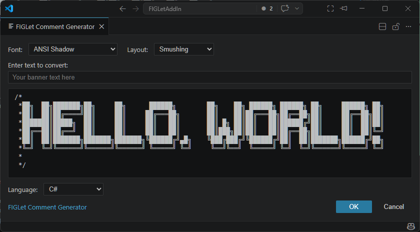
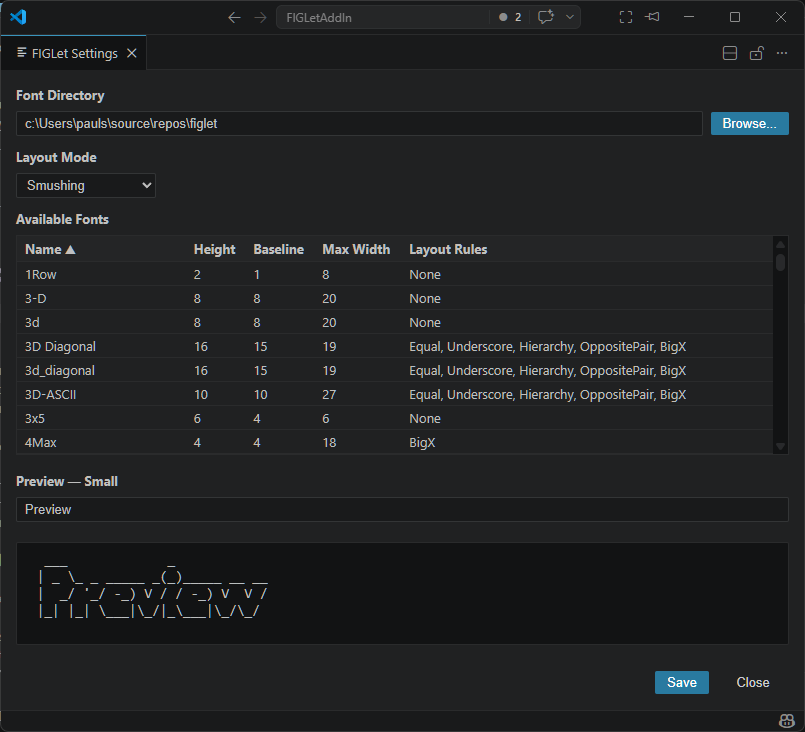

# 🌐 **BYTEFORGE FIGLET SUITE — VS CODE EXTENSION**

```
██████╗ ██╗   ██╗████████╗███████╗███████╗ ██████╗ ██████╗  ██████╗ ███████╗
██╔══██╗╚██╗ ██╔╝╚══██╔══╝██╔════╝██╔════╝██╔═══██╗██╔══██╗██╔════╝ ██╔════╝
██████╔╝ ╚████╔╝    ██║   █████╗  █████╗  ██║   ██║██████╔╝██║  ███╗█████╗
██╔══██╗  ╚██╔╝     ██║   ██╔══╝  ██╔══╝  ██║   ██║██╔══██╗██║   ██║██╔══╝
██████╔╝   ██║      ██║   ███████╗██║     ╚██████╔╝██║  ██║╚██████╔╝███████╗
╚═════╝    ╚═╝      ╚═╝   ╚══════╝╚═╝      ╚═════╝ ╚═╝  ╚═╝ ╚═════╝ ╚══════╝
                 ███████╗██╗ ██████╗ ██╗     ███████╗████████╗    ███████╗██╗   ██╗██╗████████╗███████╗
                 ██╔════╝██║██╔════╝ ██║     ██╔════╝╚══██╔══╝    ██╔════╝██║   ██║██║╚══██╔══╝██╔════╝
                 █████╗  ██║██║  ███╗██║     █████╗     ██║       ███████╗██║   ██║██║   ██║   █████╗
                 ██╔══╝  ██║██║   ██║██║     ██╔══╝     ██║       ╚════██║██║   ██║██║   ██║   ██╔══╝
                 ██║     ██║╚██████╔╝███████╗███████╗   ██║       ███████║╚██████╔╝██║   ██║   ███████╗
                 ╚═╝     ╚═╝ ╚═════╝ ╚══════╝╚══════╝   ╚═╝       ╚══════╝ ╚═════╝ ╚═╝   ╚═╝   ╚══════╝
```

> **FIGLet Comment Generator for VS Code**
> *Generate ASCII art banners directly inside your editor.*

## 📘 Overview

The **FIGLet Comment Generator** extension brings the power of FIGLet ASCII art directly into **Visual Studio Code**.
Create eye‑catching section headers, file banners, and comment blocks with just a few keystrokes — all rendered using the ByteForge FIGLet Suite engine.



This extension is powered by our own **FIGLet TypeScript Library** and integrates seamlessly with any programming language supported by VS Code.

## ✨ Features

- 🎨 Generate ASCII art banners using FIGLet fonts
- 🔤 Choose from multiple FIGLet fonts
- 🧠 Automatically wraps banners in the correct comment syntax
- ⚙️ Supports multiple layout modes (Full Size, Kerning, Smushing)
- 🧩 Context‑aware insertion based on cursor position
- ⌨️ Customizable keyboard shortcuts
- 🖥️ Retro‑terminal aesthetic with clean, modern UI

## 🛠 Installation

1. Open **VS Code**
2. Press `Shift+Ctrl+X` (Windows/Linux) or `Shift+Cmd+X` (macOS)
3. Search for `FIGLet Comment Generator`
4. Click Install

## 🚀 Usage

### **Generate a FIGLet banner**

1. Place your cursor at the line where you want the banner
2. Press `Ctrl+Alt+B` (Windows/Linux/macOS)
3. Type your text
4. Select a font (optional)
5. Press **Enter**

### Example

Input:
```
Hello, World!
```

Output (using the “small” font):
```python
#   _  _     _ _          __      __       _    _ _
#  | || |___| | |___      \ \    / /__ _ _| |__| | |
#  | __ / -_) | / _ \_     \ \/\/ / _ \ '_| / _` |_|
#  |_||_\___|_|_\___( )     \_/\_/\___/_| |_\__,_(_)
#                   |/
```

## ⚙️ Configuration



Open **Settings**, you have three methods:
1. Press `Shift+Ctrl+P` and search for `FIGLet Settings`
2. Right-click any text editor and select `FIGLet Comments > FIGLet Settings`
3. Press `Ctrl+,` (or go to `File > Preferences > Settings`) and search for `FIGlet`

You can configure:

- Default font
- Default layout mode
- Font folder location

## 🧩 Supported Languages

The extension automatically detects the file type and uses the correct comment syntax:

- C‑style languages: `//` or `/* */`
- Python: `#`
- HTML/XML: `<!-- -->`
- SQL: `--`
- PowerShell: `#`
- Many more

## 🔧 Powered By

This extension uses our own **FIGLet TypeScript Library** — part of the ByteForge FIGLet Suite — for rendering FIGLet text with full support for:

- FLF font parsing
- Layout modes (FullSize, Kerning, Smushing)
- Smushing rules (Equal, Underscore, Hierarchy, Opposite Pair, Big X, Hardblank)

## 🤝 Contributing

Contributions are welcome!
If you’d like to improve the extension:

1. Fork the repository
2. Create a feature branch
3. Commit your changes
4. Open a Pull Request

## 📜 License

This extension is licensed under the **MIT License**.

## 💡 Credits

- Original FIGLet concept by **Frank, Ian & Glenn**
- Implementations by **Paulo Santos (ByteForge)**
- FIGLet specifications: [figlet.org](http://www.figlet.org/)

## Support

If you encounter any issues or have feature requests, please:
1. Search existing [issues](https://github.com/PaulStSmith/FIGLet-comment-generator/issues)
2. Create a new issue if needed

---

Made with ❤️ by Paulo Santos
